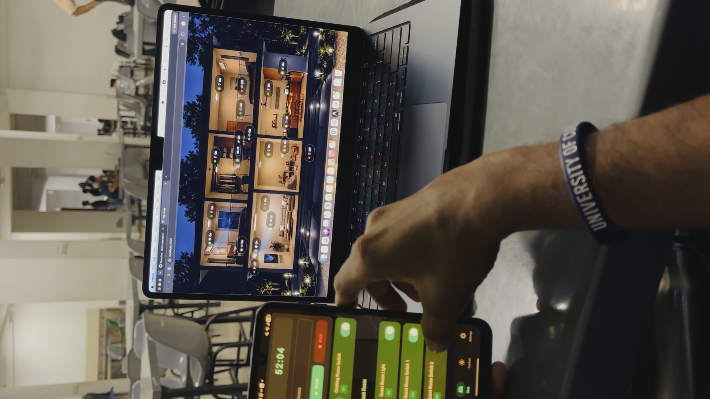

# Smart Home Management System

A smart home management system that allows users to monitor and control home devices through a web-based application and Android mobile application.

The system combines a **React web application**, **Kotlin Android application**, and **Firebase backend** to provide real-time communication and device control.

## Project Demo

Watch the complete project demonstration:

<p align="center">
  <a href="https://www.youtube.com/watch?v=l4M1lfhvAcI">
    
  </a>
</p>

<p align="center">
  <a href="https://www.youtube.com/watch?v=l4M1lfhvAcI">
    <strong>▶ Watch the Smart Home Management System Demo</strong>
  </a>
</p>

---

## Overview

<p align="center" style="transform:rotate(90deg);">  </p>
<p align="center"> <em> Smart home dashboard running on the web application alongside the Android mobile application. </em> </p>

The **Smart Home Management System** is a software-based smart home solution designed to provide users with a convenient way to manage home devices through digital interfaces.

The project consists of:

* A **React web application**
* An **Android mobile application developed with Kotlin**
* A **Firebase backend**
* Real-time synchronization between the applications and the smart home system

The system focuses on providing a simple and intuitive user experience while demonstrating real-time communication between multiple client applications.

---

## Features

### Smart Device Control

Users can control supported smart home devices through the application.

* Turn lights ON/OFF
* Control switches
* Monitor device states
* Update device states in real time

### Web Application

The React application provides a browser-based interface for managing the smart home.

Key features include:

* Responsive user interface
* Device management
* Real-time device status
* Interactive controls
* Component-based UI architecture

### Android Application

The Android application provides mobile access to the smart home system.

Built using:

* Kotlin
* Android Studio
* Jetpack Compose

The application allows users to control and monitor devices from their Android devices.

### Real-Time Synchronization

Firebase is used as the backend communication layer.

Changes made through one application can be synchronized with the other application through Firebase's real-time data capabilities.

---

## System Architecture

```text
                    ┌─────────────────────┐
                    │       User          │
                    └──────────┬──────────┘
                               │
                ┌──────────────┴──────────────┐
                │                             │
                ▼                             ▼
       ┌─────────────────┐          ┌─────────────────┐
       │  React Web App  │          │ Android App     │
       │                 │          │ Kotlin          │
       └────────┬────────┘          └────────┬────────┘
                │                            │
                │                            │
                └─────────────┬──────────────┘
                              │
                              ▼
                    ┌─────────────────────┐
                    │      Firebase       │
                    │                     │
                    │ Realtime Database   │
                    └──────────┬──────────┘
                               │
                               ▼
                    ┌─────────────────────┐
                    │  Smart Home System  │
                    │                     │
                    │ Lights / Switches   │
                    └─────────────────────┘
```

---

## Technologies Used

| Technology                 | Purpose                             |
| -------------------------- | ----------------------------------- |
| React                      | Web application frontend            |
| Kotlin                     | Android application development     |
| Jetpack Compose            | Android UI development              |
| Firebase                   | Backend and real-time communication |
| Firebase Realtime Database | Synchronizing device states         |
| JavaScript                 | Web application logic               |
| HTML & CSS                 | Web interface                       |
| Git                        | Version control                     |
| GitHub                     | Source code management              |

---

## Applications

### React Web Application

The web application was developed using **React** and provides a responsive interface for interacting with the smart home system.

React's component-based architecture was used to create reusable UI components and maintain a structured frontend.

Example application structure:

```text
React Application
│
├── Components
│   ├── Device Controls
│   ├── Navigation
│   └── UI Components
│
├── Pages
│   ├── Dashboard
│   └── Device Management
│
├── Firebase
│   └── Database Configuration
│
└── App
```

---

### Android Application

The mobile application was developed using **Kotlin** and **Jetpack Compose**.

The application provides a mobile-friendly interface for controlling the smart home.

Example structure:

```text
Android Application
│
├── UI
│   ├── Screens
│   ├── Components
│   └── Navigation
│
├── ViewModel
│
├── Firebase
│   └── Realtime Database
│
└── Main Activity
```

---

## Firebase Integration

Firebase acts as the central communication layer between the applications and the smart home system.

A simplified database structure can be represented as:

```json
{
  "devices": {
    "light_01": {
      "name": "Living Room Light",
      "status": true
    },
    "light_02": {
      "name": "Bedroom Light",
      "status": false
    },
    "switch_01": {
      "name": "Main Switch",
      "status": true
    }
  }
}
```

When a device state changes, the updated state is stored in Firebase.

The connected applications can then receive the updated state in real time.

---

## User Flow

```text
        Start
          │
          ▼
     Open Application
          │
          ▼
       Dashboard
          │
          ▼
   View Smart Devices
          │
          ▼
    Select Device
          │
          ▼
    Change Device State
          │
          ▼
      Firebase
          │
          ▼
   State Updated
          │
          ▼
 Other Connected Clients
 Receive Updated State
```

---

## UI/UX Design

The system was designed with a focus on:

* Simplicity
* Clear device controls
* Easy navigation
* Responsive layouts
* Consistent visual components
* Immediate feedback
* Mobile usability

The interface allows users to understand the current state of their devices without unnecessary complexity.

---

## Project Team

This project was developed collaboratively by:

| Member                 | Role                             |
| ---------------------- | -------------------------------- |
| **Sunali Perera**      | Development & UI/UX              |
| **Chathura Priyashan** | Development & System Integration |
| **Kasun Nuwantha**     | Development & System Integration |

---

## Getting Started

### Prerequisites

Make sure the following tools are installed:

* Node.js
* npm
* Android Studio
* JDK
* Git
* Firebase account

---

## Running the React Application

Clone the repository:

```bash
git clone https://github.com/USERNAME/REPOSITORY.git
```

Navigate to the React project:

```bash
cd react-app
```

Install dependencies:

```bash
npm install
```

Start the development server:

```bash
npm run dev
```

The application will then be available through the local development URL shown in the terminal.

---

## Running the Android Application

1. Open the Android project in **Android Studio**.
2. Configure the Firebase project.
3. Make sure the Firebase configuration file is correctly placed in the Android project.
4. Connect an Android device or start an emulator.
5. Build and run the application.

---

## Firebase Setup

Create a Firebase project and configure the required Firebase services.

The applications need to be connected to the same Firebase project so that device states can be synchronized.

For security, Firebase credentials and sensitive configuration files should **not be committed to the repository**.

Add sensitive configuration files to `.gitignore` where appropriate.

---

## Project Goals

The main objectives of this project were to:

* Develop a functional smart home management interface.
* Demonstrate real-time communication using Firebase.
* Build both web and mobile interfaces.
* Apply UI/UX principles to a real-world software system.
* Develop reusable frontend components.
* Explore cross-platform smart home management.
* Provide a simple interface for controlling smart devices.

---

## Future Improvements

Possible future improvements include:

* Adding authentication and user accounts
* Adding more smart home devices
* Adding device scheduling
* Adding automation rules
* Adding notifications
* Adding energy consumption monitoring
* Adding voice control
* Adding device grouping
* Adding room-based device management
* Improving accessibility
* Adding IoT hardware integration
* Adding historical device activity
* Adding AI-based automation recommendations

---

## Demo

**YouTube:**
https://youtu.be/l4M1lfhvAcI

---

## License

This project was developed as an academic/software engineering project.

Copyright © 2026 **Sunali Perera, Chathura Priyashan, and Kasun Nuwantha**.
